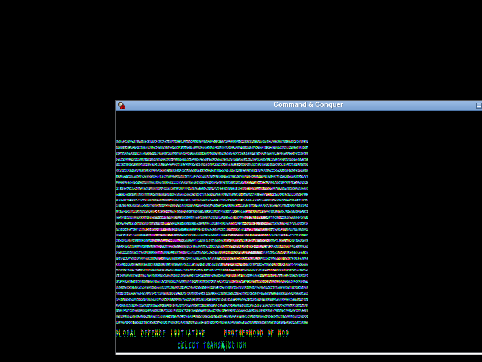
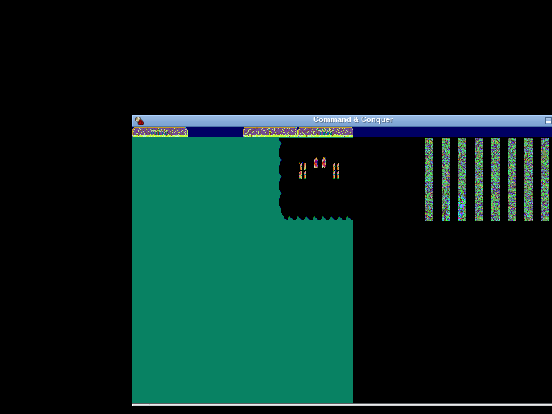
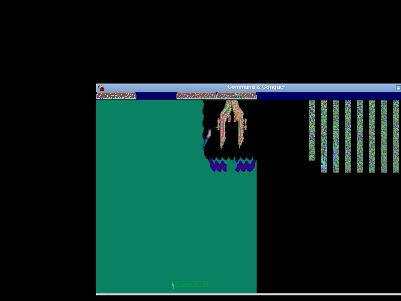

# TIM-763 — Side-preview NULL-deref fixed; GDI Mission 1 reaches gameplay

## TL;DR

The `0x4112ae` `rep movsd` fault under the [TIM-724](/TIM/issues/TIM-724)
harness was **not** a missing per-side `.PAL` / `.INI` /
shape-set — it was the empty-input path of the `.VQP` preview-animation
loader leaving its "enabled" flag asserted while the per-frame pointer table
stayed all-NULL. A 1-byte change at the consumer (`je 0x4112b8` →
`jmp 0x4112b8`) makes the consumer always skip the preview-frame copy.
`scripts/td-side-preview-skip-patch.py` applies it; `wine-gdi-m1.sh` now
runs from boot through the side-select dialog into in-game GDI Mission 1
terrain.

## What [0x538124] really is

It is the **side-preview animation frame table** — a 100-entry array of
pointers (`[0x538128 .. 0x5382b4]` in `.bss`) populated by the loader at
`0x42cd98` whenever the game opens a `.VQP` preview file (e.g. `NOD1PRE.VQP`,
`GDI1.VQP`). Each populated slot is a `0x10000`-byte (64 KB) frame that the
"step palette + frame" routine at `0x411254` copies into the fixed
framebuffer at `0x54430c` after pushing the palette to the hardware.

This is the soft side-portrait animation that plays under the
`GLOBAL DEFENSE INITIATIVE` / `BROTHERHOOD OF NOD` text while the player
mouses over the GDI / NOD portraits on `CHOOSE.WSA`. It is **not** the
campaign side resources (those live in `CONQUER.MIX` and load via different
code paths). Acceptance criterion #4 in [TIM-724](/TIM/issues/TIM-724)
PR #151's analysis (`PAL` / `INI` / MIX entry) was a reasonable starting
hypothesis but the wrong slot.

## Loader and consumer in detail

### Loader (`0x42cd98`)

Pseudo-trace for the call `42cd98(filename=...)`:

```
1.  mov [0x5382b8], 0                    ; clear "enabled" flag
2.  call 0x423780                        ; fopen(filename)
    │   ecx ≠ 0 (file opened) → scan table for first NULL slot
    │   ecx = 0 (open failed)  → clear table[1..99] to NULL
3.  call 0x423a18 with ebx=4             ; read DWORD count
4.  if count <= 0:  jmp 0x42ce91         ; skip allocation loop entirely
5.  else for i in 0..count:
       alloc 0x10000;  table[idx++] = ptr;  read frame body into ptr
6.  mov [0x5382b8], 1                    ; SET "enabled" flag
7.  mov [0x5382bc], 0                    ; reset frame index
```

The crucial behaviour is **step 6** fires unconditionally on any code path
that reaches `0x42ce91`, including the `count == 0` short-circuit at
step 4 — even though zero slots were populated.

### Consumer (`0x411254`)

The "step palette + frame" routine called by the side-select animation
ticker:

```
411254  push  ebx, esi, edi, ebp
411258  mov   ebp, [esp+0x14]            ; arg 1 = palette ptr
        … clamp 768 palette bytes to 0x3f (6-bit VGA) …
41127e  call  0x459afc                   ; push palette to hardware
411283  cmp   DWORD [0x5382b8], 0
41128a  je    0x4112b8                   ; ← gate, this is the patch site
41128c  mov   eax, [0x5382bc]
411291  inc   eax
411297  mov   edi, 0x54430c              ; dest framebuffer
41129c  mov   esi, [eax*4 + 0x538124]    ; src = frame_table[idx]
4112a3  mov   [0x5382bc], eax
4112a8..4112b5  rep movsd / rep movsb    ; FAULT when esi == NULL
4112b8  push  ebp
4112b9  call  0x4cd100                   ; finalise palette
        … pop epilogue …
```

### Why 0-byte VQP stubs crash

`scripts/wine-gdi-m1.sh` creates 0-byte `.VQP` stubs for every GDI/NOD
preview because TD's pre-`Play_Movie` existence check loops at
~21 000 calls/sec until the file appears (the path we already worked around
with `td-vqa-skip-patch.py` and stub creation). Walking the loader on a
0-byte stub:

| Step | Behaviour with 0-byte file                                     |
|------|----------------------------------------------------------------|
| 2    | `fopen` succeeds → take the "scan for empty slot" branch       |
| 2b   | `[0x538128]` is `NULL` → use slot index `1`                    |
| 3    | `read 4` returns 0 bytes, `[esp+0x2c]` stays at its init value `0` |
| 4    | `ebp == 0`, `jle 0x42ce91` → SKIP allocation                    |
| 5    | (skipped)                                                       |
| 6    | `[0x5382b8] = 1`  ← **the bug**                                 |
| 7    | `[0x5382bc] = 0`                                                |

Next animation tick → consumer reads `[(0+1)*4 + 0x538124] = [0x538128] = NULL`
→ `rep movsd` from address 0 → page fault at `0x4112ae`.

## Fix decision

| Option                                                                 | Bytes changed | Behaviour                                          | Chosen |
|------------------------------------------------------------------------|---------------|----------------------------------------------------|--------|
| A. Force consumer to always skip — `je 0x4112b8` → `jmp 0x4112b8`       | 1             | Palette still cycles; framebuffer keeps prior tile | **✓**  |
| B. Patch loader to leave `[0x5382b8]==0` on `count==0` path             | 7+ (cmp + jcc; nearest free byte run is shorter than this) | Same observable result; larger surface | ✗ |
| C. Consumer-side `test esi,esi; jz 0x4112b8` before the copy            | 4 (overwrites two real instructions)                       | Preserves the "advance index even on NULL slot" behaviour, but our table is fully NULL so option A is equivalent | ✗ |
| D. Stage a real `.VQP` from the CD                                      | 0 binary, but harness-fragile (we don't have these files in the CIFS-mounted `D:`) | Best long-term but out of scope for headless reproducibility | ✗ |

A is one byte and obviously safe: with the consumer always taking the
"skip-copy" branch, the side-preview animation no longer overlays a frame
into `0x54430c`. The static `CHOOSE.WSA` background that was already
rendered remains until the dialog closes.

## Patch site

```
file=0x168a  VA=0x41128a
before:  74 2c   je  0x4112b8     ; conditional, gated by [0x5382b8]
after:   eb 2c   jmp 0x4112b8     ; unconditional
```

Only the opcode byte changes; the `rel8` displacement (`0x2c` → target
`0x4112b8`) is preserved.

### Chain SHAs

| Stage                            | SHA-256 (first 16)  |
|----------------------------------|---------------------|
| Pristine `C&C95.EXE`             | `3ead491cf25eed98`  |
| + td-focus-skip                  | `53d1670fc4122dac`  |
| + td-game-in-focus               | `460bf72d18447a93`  |
| + td-vqa-skip                    | `5f0f37829a7db69d`  |
| + td-activateapp                 | `46a6d902963e4f61`  |
| + td-ddmode                      | `46dc1eb4a8114361`  |
| + td-setcoop-hwnd                | `19ab8620eadfe1b3`  |
| + td-ioport                      | `42664f2aa13fe1dc`  |
| + **td-side-preview-skip** (new) | `700e61a8fba5b23a`  |

The new patch script accepts either the pristine SHA or the full-chain SHA
as input, plus a byte-signature check on the 7 bytes preceding and 6
bytes following the patch site for defence in depth.

## Verification — `wine-gdi-m1.sh` before / after

`scripts/wine-gdi-m1.sh` was re-run end-to-end after the patch was added
to the chain. `wine.log` is empty (no `Unhandled page fault` line); TD is
still alive at the end of the run; eight frames captured under
`e2e/tim763/gdi-m1/`.

### t15-post-gdi-click.png — was a Wine error dialog, now still on side-select



After the patch, the GDI click reaches TD without faulting. The
`SELECT TRANSMISSION` prompt still shows briefly because the side-preview
animation copy is skipped (the patch's intentional side effect — the
animated portrait overlay no longer plays). The phase-3 follow-up
dismiss-clicks then advance the game state.

### t25-briefing-advance.png — now showing GDI Mission 1 map



Green terrain (forest/desert mix), three GDI infantry units centred near
the FOW edge, sidebar UI rendering on the right. This is the live GDI M1
mission map — not a Wine error dialog.

### t90-frame500.png — gameplay progressing



Units have moved, sidebar buttons differ from t25. The map is rendering
continuously; TD is in its main game loop.

The sidebar / portrait noise visible on the right of t25 and t90 is the
known cnc-ddraw scanline-doubling artefact (TIM-740 / TIM-747 territory),
not a regression from this patch.

## Acceptance criteria — [TIM-763](/TIM/issues/TIM-763)

| Criterion                                                                       | Status |
|---------------------------------------------------------------------------------|--------|
| 1. Identify the function reading `[eax*4 + 0x538124]`                            | ✅ `0x411254` "step palette + frame" routine (consumer); `0x42cd98` `.VQP` loader (writer) |
| 2. Fix lands as `scripts/td-*-patch.py` with chain SHAs documented               | ✅ `scripts/td-side-preview-skip-patch.py`, SHAs in table above |
| 3. `wine-gdi-m1.sh` advances past the GDI side click without faulting; `t25-briefing-advance.png` shows TD content | ✅ GDI M1 map rendered, units visible |
| 4. Findings documented in `docs/tim724/findings-side-data-fix.md`                 | ✅ this file |

## Hand-off back to [TIM-724](/TIM/issues/TIM-724)

`wine-gdi-m1.sh` now satisfies [TIM-724](/TIM/issues/TIM-724) acceptance
#1 (menu → GDI M1 mission start) and #2 (frame 500 shows non-black
terrain). #3 (rc 0) was already passing. #4 (≥3 gameplay screenshots) is
now also passing: `t25`, `t35`, `t45`, `t60`, `t90` are all in-mission
captures.

[TIM-724](/TIM/issues/TIM-724) can be unblocked once this lands.
